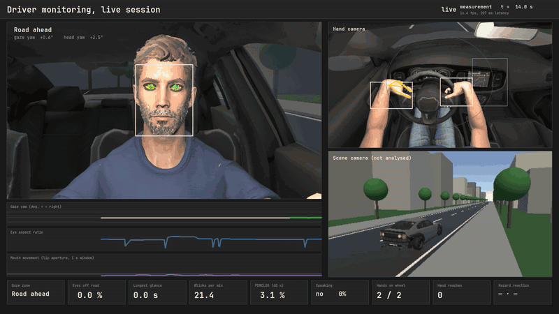
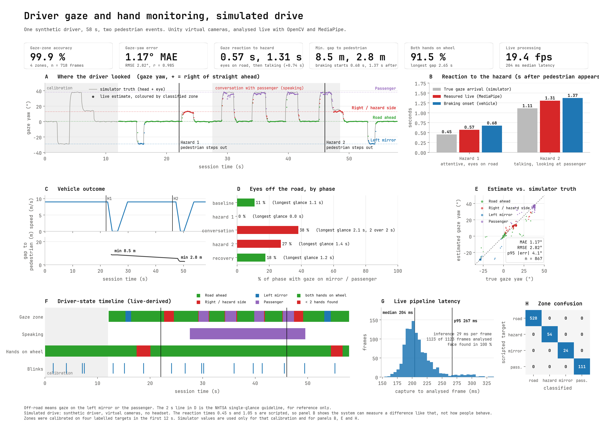

# GazeGrip

Live gaze and hand monitoring of a simulated driver. Virtual cameras in Unity stream frames to a Python program that
tracks the driver's eyes, mouth and hands with MediaPipe and OpenCV while a scripted drive is running, then checks
its own measurements against what the simulator knows to be true.

[](docs/demo.mp4)

*Sixteen seconds of a live session, in real time. The full 58 second recording is [`docs/demo.mp4`](docs/demo.mp4).*

This started as a module inside my Unity driving simulator,
[VehicleSafetySim_2026](https://github.com/AbhishekDubasi09/VehicleSafetySim_2026), and the two repositories describe
the same work from two sides. The simulator is there; this one holds the analysis side and the scripts that drive it.

## What it does

A synthetic driver sits in the car and follows a scripted 58 second drive. He blinks, shifts his gaze between the road,
the left mirror and the passenger seat, talks to someone off screen, reaches for the centre display twice, and reacts to
two pedestrians who step into the road. Three virtual cameras (face, hands and wheel, outside view) send JPEG frames
over a local TCP socket. The Python side then:

- finds the face and iris with MediaPipe and turns head yaw and iris position into a horizontal gaze angle
- assigns that angle to a zone (road, left mirror, passenger, hazard side) with a short debounce
- counts blinks and eyes-off-road time, and estimates speech from how much the lip aperture changes
- decides whether each hand is on the wheel, and flags a reach to the display
- measures the delay between a pedestrian appearing and the gaze arriving on the hazard side
- draws a live dashboard, records it, and writes a report once the drive ends

The simulator also writes its own ground truth for every frame (true head and eye angles, blink and jaw state,
whether a hand is reaching). The analysis never uses it while measuring. It is used for the first twelve seconds, when the
driver looks at four labelled targets so a linear model can be fitted, and afterwards only to score the measurements.

## Results

One session of 1,123 frames. These are checks of the measurement chain against the simulator, not findings about real
drivers.

| Measurement | Result |
|---|---|
| Horizontal gaze angle, mean absolute error | 1.17 degrees (RMSE 2.82, 95th percentile 4.07, r = 0.985) |
| Gaze zone correct, steady frames | 99.9 % of 718 frames |
| Gaze reaction to pedestrian 1 | 0.568 s measured, 0.454 s true (+114 ms) |
| Gaze reaction to pedestrian 2 | 1.307 s measured, 1.111 s true (+196 ms) |
| Blinks | 17 detected, 17 rendered |
| Speech detection | precision 99.1 %, recall 96.6 % |
| Both hands on the wheel | 91.5 % of frames |
| Reaches to the display | 2 found, 2 scripted |
| Pipeline | 19.4 frames per second, 204 ms median delay from capture to analysed frame |

The report with the full set of numbers and the gaze traces is in [`docs/session_report.html`](docs/session_report.html).
The raw measurements are in [`results/`](results).



## Limitations

- It is a simulation. There is no headset, no physical camera and no real person. The two reaction delays (0.45 s and
  1.05 s) and the glance timings are written into the script, so the results show that the system can measure a difference
  like that and nothing more.
- The thresholds and the calibration were tuned on earlier runs of this same simulation, so the numbers are optimistic. It
  is one subject, one session and clean rendering.
- The measured reaction times are late by about 0.1 to 0.2 s. The two-frame debounce accounts for roughly 0.1 s of that, which
  is my explanation and not something I measured separately.
- MediaPipe hand landmarks do not follow a closed hand around the rim of the wheel. Wheel contact is therefore decided by
  OpenCV skin segmentation (HSV 3 to 24, 40 to 200, 90 to 255) in fixed regions of the hand-camera image. Those regions and
  thresholds only suit this camera position and this skin tone.
- Only horizontal gaze is estimated. The vertical iris position was too noisy.
- A headset hides the eyes, so gaze from a cabin camera applies to a physical simulator or screen setup. The Quest 3 has
  no eye tracking, so a headset system would need another gaze source. Hands, mouth and body would still work from a camera.
- Unity delivered about 19 frames per second with three cameras and the analysis on one PC, not 30.

## Repository layout

```
gazegrip/      the Python side
  live_dms.py        receiver, analysis, dashboard and recording
  session_metrics.py post-drive numbers, validated against the simulator's ground truth
  report.py          figure and HTML report
  typo.py            typeface setup
unity/         the simulator side (C#): the driver, the scripted drive, the camera streamer, editor tools
results/       the saved session the numbers above come from
docs/          demo video, screenshots, session report
scripts/       setup and run scripts (Windows PowerShell)
tests/         tests for the metric code
```

## Running it

**Recompute the numbers from the saved session** (any OS with Python 3.11):

```bash
pip install -r requirements.txt -r requirements-dev.txt
python -m pytest tests
```

The tests recompute every headline metric from the files in `results/` and compare them with the saved results.

**Run a live session** (Windows). This needs a Unity project to stream from, which this repository does not include
in full:

1. Run `scripts/setup.ps1`. It creates the virtual environment and downloads the MediaPipe model files and the
   JetBrains Mono font.
2. Use Unity 6000.0.60f1 with URP 17.0.4. Copy the C# files from `unity/` into a project that has a car, for example
   [VehicleSafetySim_2026](https://github.com/AbhishekDubasi09/VehicleSafetySim_2026).
3. The driver is a Reallusion Character Creator 5 character. The model and its textures are not included, because they
   are licensed assets. The scene builder and the driver script are written for that character's rig, so another character
   would need changes.
4. Run `scripts/run_live.ps1 -UnityProject <path to the Unity project>`. The dashboard window shows "Waiting for Unity"
   for about a minute, then the 58 second drive runs.
5. Afterwards run `python gazegrip/report.py` to write the report.

With a real camera, the receiver would read a webcam instead of the socket and the analysis would stay the same.

## Credits and licences

Face and hand tracking use [MediaPipe](https://github.com/google-ai-edge/mediapipe) (Apache 2.0). The model files are
downloaded by the setup script and are not stored here. The dashboard uses
[JetBrains Mono](https://github.com/JetBrains/JetBrainsMono) (SIL Open Font License), also downloaded by the setup script.
The driver character is a Reallusion Character Creator model and is not redistributed. My own code is released under the
MIT licence, see [LICENSE](LICENSE).
