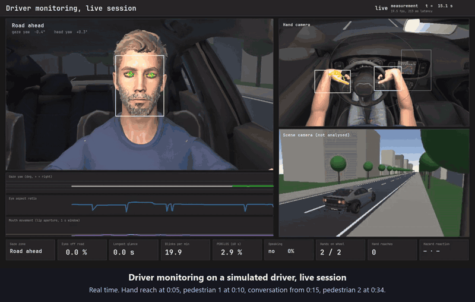
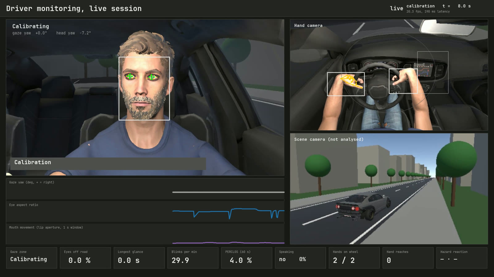
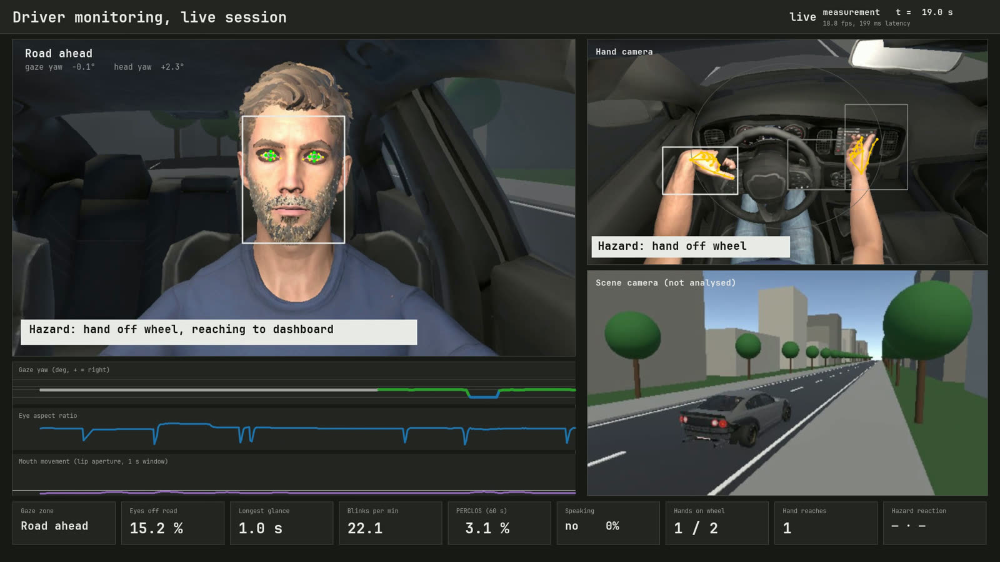
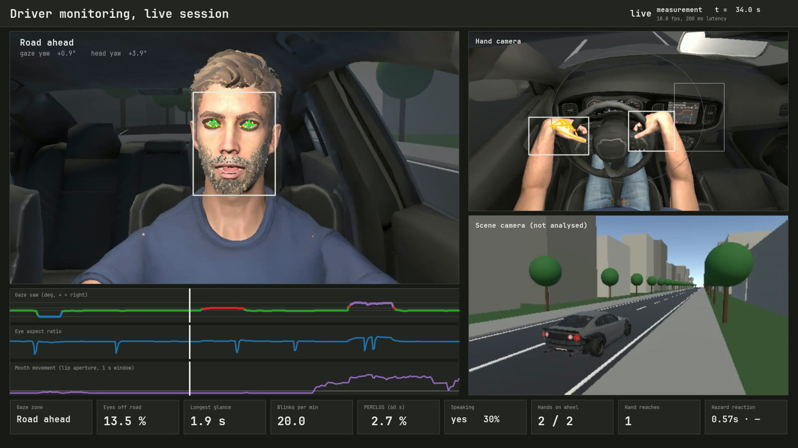
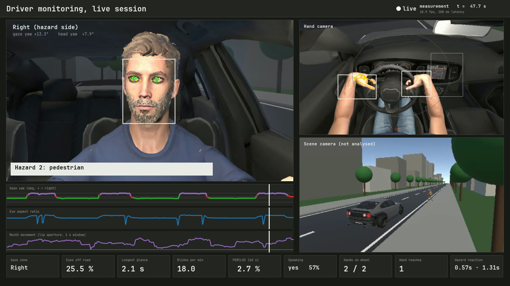
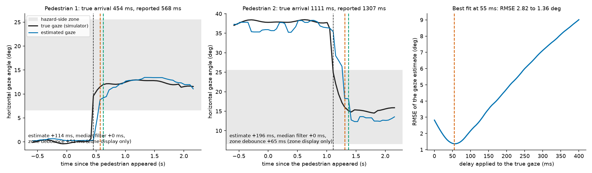

# Validating camera-based driver monitoring against simulator ground truth

[](https://github.com/AbhishekDubasi09/driver-monitoring-validation/actions/workflows/ci.yml)
[](LICENSE)

A simulated driver is filmed by virtual cameras in Unity. A Python pipeline tracks gaze, glances, hands and reaction time
from those frames with MediaPipe and OpenCV, and the results are scored against what the simulator knows to be true.

[](docs/live-session.mp4)

*Twenty seconds of the live session, in real time. The full recording of the second half of the drive, with both pedestrians and the conversation, is [`docs/live-session.mp4`](docs/live-session.mp4) (46 seconds). The clip starts 12 seconds into the drive.*

This started as a module inside my Unity driving simulator,
[VehicleSafetySim_2026](https://github.com/AbhishekDubasi09/VehicleSafetySim_2026), and the two repositories describe the
same work from two sides. This one holds the analysis, the saved session and the scripts that drive it.

## Research question

> How accurately can a camera-based driver-monitoring pipeline (gaze zone, glance duration, hand contact and reaction
> time) be validated against a simulator's own ground truth, and where does the timing error of the measurement come from?

Driver monitoring is judged on timing as much as on direction. Euro NCAP's driver-monitoring protocols, for example, define
distraction through the duration of glances away from the road, with thresholds of the order of two to three seconds (see the
[protocol](https://cdn.euroncap.com/media/67892/euro-ncap-assessment-protocol-sa-safe-driving-v1001.pdf) for the exact
definitions). A measurement that is 0.1 to 0.2 s late can matter for a rule like that, and with a real person you cannot say
at that precision where they were looking. A simulator can. The idea of testing in-cabin algorithms on a platform with
ground-truth sensors is not new; the [DFKI Cabin Simulator](https://arxiv.org/abs/2002.03749) is one example. What I did here
is a small, reproducible version of it, with the saved data and the analysis included.

## Approach

A synthetic driver follows a scripted 58 second drive. He looks at the road, the left mirror and the passenger seat, talks to
someone off screen, reaches for the centre display twice, and reacts to two pedestrians. Three virtual cameras send frames
to the Python side over a local TCP socket, and the pipeline works on them live:

- MediaPipe finds the face and iris. Head yaw and iris position are combined into a horizontal gaze angle with a linear
  model fitted during the first twelve seconds, while the driver looks at four labelled targets.
- The angle is assigned to a zone (road, left mirror, passenger, hazard side) with a three-frame median filter and a
  two-frame debounce.
- Blinks come from the eyelid blendshapes, and speech from how much the lip aperture changes.
- Wheel contact and reaches are decided by OpenCV skin segmentation in fixed regions of the hand-camera image.
- The reaction time is the delay between a pedestrian appearing and the estimated gaze reaching the hazard-side zone.

The simulator writes its own ground truth for every frame: true head and eye angles, blink and jaw state, and whether a
hand is reaching. The pipeline never uses it while measuring. It is used for the calibration and afterwards only to score the
measurements. `driver_monitoring/delay_analysis.py` then compares timings against it.

### The dashboard at four moments

| Calibration | Hand reach | Conversation | Second pedestrian |
|---|---|---|---|
|  |  |  |  |

## Findings

One session of 1,123 frames. These are checks of a measurement chain, not findings about real drivers.

**Accuracy**

| Measurement | Result |
|---|---|
| Horizontal gaze angle, mean absolute error | 1.17 degrees (RMSE 2.82, 95th percentile 4.07, r = 0.985) |
| Gaze zone correct, steady frames | 99.9 % of 718 frames |
| Blinks | 17 detected, 17 rendered |
| Speech detection | precision 99.1 %, recall 96.6 % |
| Both hands on the wheel | 91.5 % of frames |
| Reaches to the display | 2 found, 2 scripted |
| Capture to analysed frame | 204 ms median, 267 ms 95th percentile, at 19.4 frames per second |

**Timing**



- **Reaction time is late by 114 ms and 196 ms.** The pipeline reported 0.568 s and 1.307 s against a true 0.454 s and
  1.111 s. The median filter adds nothing to this. The two-frame debounce adds 51 and 65 ms to the zone shown on the dashboard,
  but the reaction time is taken from the raw estimate, so the debounce is not part of the reported number. The delay is already
  in the gaze estimate.
- **The estimate runs about one frame behind.** Shifting the true gaze by 55 ms gives the best match, and the error drops from
  2.82 to 1.36 degrees RMSE. About half of the gaze error is therefore a constant delay and the rest is the estimator. I did not
  find out where that delay comes from. A timestamp offset in how frames are captured and read back is one candidate.
- **Glance starts are detected late, durations are close.** All six glances away from the road were found. Starts were late by
  164 ms on average (100 to 239 ms), and durations were off by 25 ms on average, with individual errors up to about 0.1 s.
- **A two second threshold is delicate at this precision.** Three of the six true glances lasted 1.95, 1.97 and 2.00 s, all within
  0.1 s of the mark. In this session the count above two seconds agreed with the truth, but a duration error of 0.1 s is enough to
  flip three of the six.
- **Reaches are timed within about 0.1 s.** Detected starts were 51 and 72 ms early, and ends were 88 and 62 ms late.

The full numbers are in [`results/session_metrics.json`](results/session_metrics.json) and
[`results/delay_analysis.json`](results/delay_analysis.json), and a report with the gaze traces is in
[`docs/session_report.html`](docs/session_report.html).

## What someone building a monitoring system could take from this

Log ground truth for every frame, measure with the real analysis chain, and then report the delay of the measurement
separately from its accuracy. Here that showed the pipeline was late in a way the error figure alone would hide. Then check how
close the true values sit to the thresholds of the rule you care about, because that decides whether a small timing error
matters. All of this is in the code and the tests, and none of it needs the simulator once a session has been saved.

## Limitations

- It is a simulation. There is no headset, no physical camera and no real person. The two reaction delays (0.45 s and 1.05 s)
  and the glance timings are written into the script, so the results show that the system can measure a difference like that and
  nothing more.
- The thresholds and the calibration were tuned on earlier runs of this simulation, so the numbers are optimistic. It is one
  subject, one session and clean rendering.
- The delay figures come from one session with two reaction events and six glances, so they are estimates and not
  distributions. I would want many sessions before putting error bars on them.
- MediaPipe hand landmarks do not follow a closed hand around the rim of the wheel, so wheel contact uses OpenCV skin
  segmentation (HSV 3 to 24, 40 to 200, 90 to 255) in fixed regions. Those regions and thresholds only suit this camera
  position and this skin tone.
- Only horizontal gaze is estimated. The vertical iris position was too noisy.
- A headset hides the eyes, so gaze from a cabin camera applies to a physical simulator or screen setup. The Quest 3 has no eye
  tracking, so a headset system would need another gaze source.
- Unity delivered about 19 frames per second with three cameras and the analysis on one PC, not 30.

## Repository layout

```
driver_monitoring/      the Python side
  live_dms.py        receiver, analysis, dashboard and recording
  session_metrics.py post-drive numbers, validated against the simulator's ground truth
  delay_analysis.py  where the timing error comes from; glance and reach timing
  figures.py         the delay figure
  report.py          figure and HTML report for a live session
  typo.py            typeface setup
unity/         the simulator side (C#): the driver, the scripted drive, the camera streamer, editor tools
results/       the saved session and the numbers computed from it
docs/          demo video, screenshots, figures, session report
scripts/       setup and run scripts (Windows PowerShell)
.github/       continuous integration
tests/         tests for the metric code and the delay analysis
```

## Running it

**Recompute everything from the saved session** (any OS, Python 3.11):

```bash
pip install -r requirements-analysis.txt -r requirements-dev.txt
python -m pytest tests
python driver_monitoring/delay_analysis.py results
python driver_monitoring/figures.py results docs/delay_breakdown.png
```

**Run a live session** (Windows). This needs a Unity project to stream from, which this repository does not include in full:

1. Run `scripts/setup.ps1`. It creates the virtual environment and downloads the MediaPipe model files and the JetBrains Mono font.
2. Use Unity 6000.0.60f1 with URP 17.0.4. Copy the C# files from `unity/` into a project that has a car, for example
   [VehicleSafetySim_2026](https://github.com/AbhishekDubasi09/VehicleSafetySim_2026).
3. The driver is a Reallusion Character Creator 5 character. The model and its textures are not included, because they are
   licensed assets. The scene builder and the driver script are written for that character's rig, so another character would
   need changes.
4. Run `scripts/run_live.ps1 -UnityProject <path to the Unity project>`. The dashboard window shows "Waiting for Unity" for about
   a minute, then the 58 second drive runs.
5. Afterwards run `python driver_monitoring/report.py` to write the report.

With a real camera, the receiver would read a webcam instead of the socket and the analysis would stay the same.

## Credits and licences

Face and hand tracking use [MediaPipe](https://github.com/google-ai-edge/mediapipe) (Apache 2.0). The model files are downloaded
by the setup script and are not stored here. The dashboard uses [JetBrains Mono](https://github.com/JetBrains/JetBrainsMono)
(SIL Open Font License), also downloaded by the setup script. The driver character is a Reallusion Character Creator model and is
not redistributed. My own code is released under the MIT licence, see [LICENSE](LICENSE).

If you cite this work, GitHub's "Cite this repository" button uses [`CITATION.cff`](CITATION.cff).
